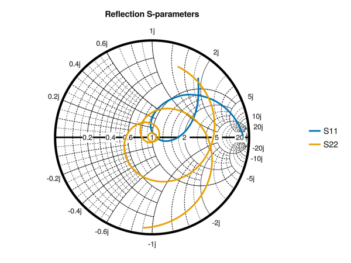
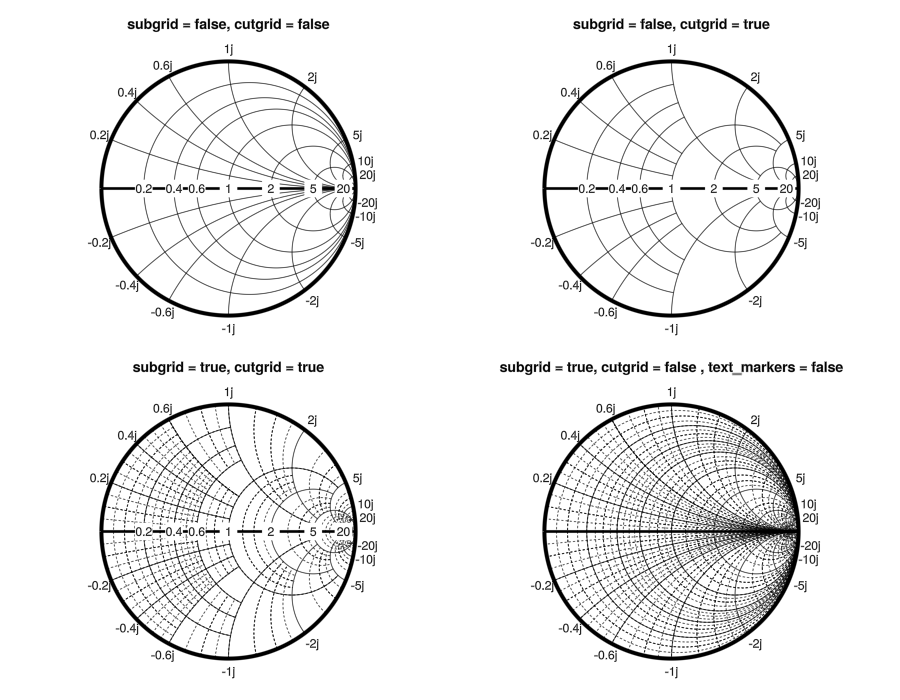

# SmithChart

A Julia library for creating interactive Smith charts using Makie.jl.
This project originated as an exploration of the interactive possibilities that Makie.jl offers.

**Note**: Perhaps it would make more sense to create a custom `Block` rather than drawing directly on an `Axis` to allow for better layout control. Some features of the Makie.jl library are still being explored.

**Note**: Certain visual details of the Smith Chart may require further refinement to enhance aesthetic and overall visual quality.

## Missing Features

* Admittance Smith Chart
* ZY Smith Chart

## Usage

```julia
using SmithChart
using GLMakie # Selected Backend 
fig = Figure()
ax = Axis(fig[1, 1]; aspect=1, limits=(-1.2, 1.2, -1.2, 1.2), title = "Variable Length Lossy Transmission Line")
drawsmithchart!(ax, subgrid = true, cutgrid = true, zoomupdate = false)
# Lossy transmission line
Zo = 50
Zl = 100 + 50im
f = 3.0e9
λ = 3.0e8/f
σ = 6.5
β = 2*pi/λ
s = σ + β*im
l = range(0,λ,101)
# Normalized Impedance
z = [(Zl+(Zo*tanh(s*li)))/(Zo+(Zl*tanh(s*li))) for li in l]
# Draw lines on the Smith Chart
smithplot!(ax, z, reflection = false, color = 1:101)
# Scatter points on the origin and end points
smithscatter!(ax, [z[1]], markersize = 12.0)
smithscatter!(ax, [z[end]], markersize = 12.0, marker = :cross)
# Colorbar representing the length of the line
Colorbar(fig[1,2], limits = (l[1]/λ, l[end]/λ), ticks = ([0.0, 0.5, 1.0], ["0.0λ", "0.5λ", "1.0λ"]))
# Activate Data Inspector
DataInspector(fig)
fig
```


You can also draw reflection coefficients (S-parameters) with the `reflection = true` keyword. If you have a two vectors of complex numbers `s11` and `s22` you can plot it without transforming the data.

```julia
smithplot!(ax, s11, reflection = true, label = "S11")
smithplot!(ax, s22, reflection = true, label = "S22")
fig[1, 2] = Legend(fig, ax, framevisible = false)
fig
```



## Dynamic Annotation Update

You can activate a experimental dynamic curve annotation with the keyword `textupdate = true`

```julia
fig = Figure(size = (800,600))
ax = Axis(fig[1, 1]; aspect=1, limits=(-1.2, 1.2, -1.2, 1.2))
drawsmithchart!(ax, subgrid = true, cutgrid = true, zoomupdate = true, textupdate = true)
```


## Other Keywords

Here are some of the available grid options. For more details on keywords, use `? smithchart`


