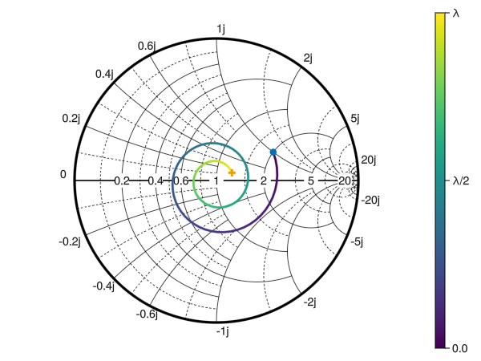
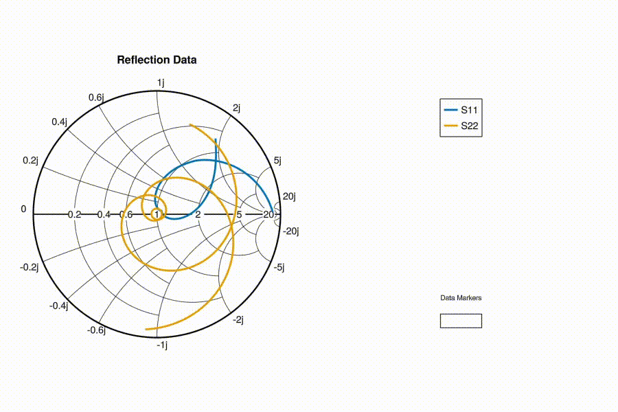

# SmithChart

A Julia library for creating interactive Smith charts using Makie.jl.
This project originated as an exploration of the interactive possibilities that Makie offers.

**Note**: Certain visual details of the Smith Chart may require further refinement to enhance aesthetic and overall visual quality.

**Note**: Some of the features are experimental. They might not function fully as expected or could be subject to changes in future versions. 

Some examples are shown below. For more information and other examples, visit the documentation.

## Usage

```julia
using SmithChart
using GLMakie # Select Backend 
fig = Figure()
ax = SmithAxis(fig[1, 1]; cutgrid = true, subgrid = true, title = "Variable Length Lossy Transmission Line")
# Lossy transmission line
Zo = 50
Zl = 100 + 50im
f = 3.0e9
λ = 3.0e8/f
σ = 6.5
β = 2*pi/λ
s = σ + β*im
l = range(0,λ,101)
# Normalized Impedance
z = [(Zl+(Zo*tanh(s*li)))/(Zo+(Zl*tanh(s*li))) for li in l]
# Draw lines on the Smith Chart
smithplot!(ax, z, reflection = false, color = 1:101, freq = 3.0e9 * ones(length(z)))
# Scatter points on the origin and end points
smithscatter!(ax, [z[1]], markersize = 12.0)
smithscatter!(ax, [z[end]], markersize = 12.0, marker = :cross)
# Colorbar representing the length of the line
Colorbar(fig[1,2], limits = (l[1]/λ, l[end]/λ), ticks = ([0.0, 0.5, 1.0], ["0.0", "λ/2", "λ"]))
# Activate Data Inspector
DataInspector(fig)
fig
```



## Integration with Makie

This example showcases the seamless integration of the Smith chart with Makie.jl's interactive functionalities. It demonstrates a typical scenario used to teach impedance matching, where we aim to transform a source impedance of 50+100j $\Omega$ to a load impedance of 50 $\Omega$. To achieve this, we utilize a transmission line and a parallel stub, and control their lengths via sliders. By dynamically adjusting these lengths, users can observe how the source impedance seen by the load evolves on the Smith chart, visually illustrating the impedance matching process.

```julia

fig = Figure()
ax = SmithAxis(fig[1, 1], title = "Stub Matching")

Zl = 50.0
Ri = 50.0
Xi = 100.0
zi = Ri + Xi*im
zi = zi / Zl

function simline(z, l)
    bl = 2 * pi * l # Electrical length
    return (z + im * tan(bl)) / (1 + im * z * tan(bl))
end

function simstub(z, l)
    bl = 2 * pi * l
    y_stub = im * tan(-bl)
    return 1 / ((1 / z) + y_stub) 
end

N = 101
sg = SliderGrid(
    fig[2, 1],
    (label = "Line", range = range(0.0, 0.5, 151), format = "{:.3f}λ", startvalue = 0.0),
    (label = "Stub", range = range(0.0, 0.5, 151), format = "{:.3f}λ", startvalue = 0.0))

sliderobservables = [s.value for s in sg.sliders]
z = lift(sliderobservables...) do slvalues...
    line_index, stub_index = [slvalues...]
    line_p = range(0.0, line_index, N)
    stub_p = range(0.0, stub_index, N)
    z_line = simline.(zi, line_p)
    z_stub = simstub.(z_line[end], stub_p)
    return [zi; z_line; z_stub]
end

zend = lift(x->x[end], z)
smithscatter!(zi)
smithplot!(z)
smithscatter!(zend)
fig
```


## Interactive Data Markers

Interactive data markers can be added to your Smith chart using the `datamarkers(sc::SmithAxis, gp::GridPosition)` function. Double-click on lines or scatter plots to place a marker. To remove a marker, double-click on it. It is possible to move the marker by dragging it with the left click.

