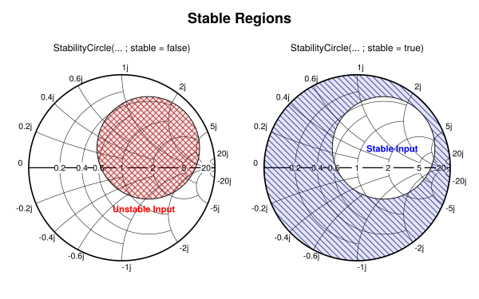
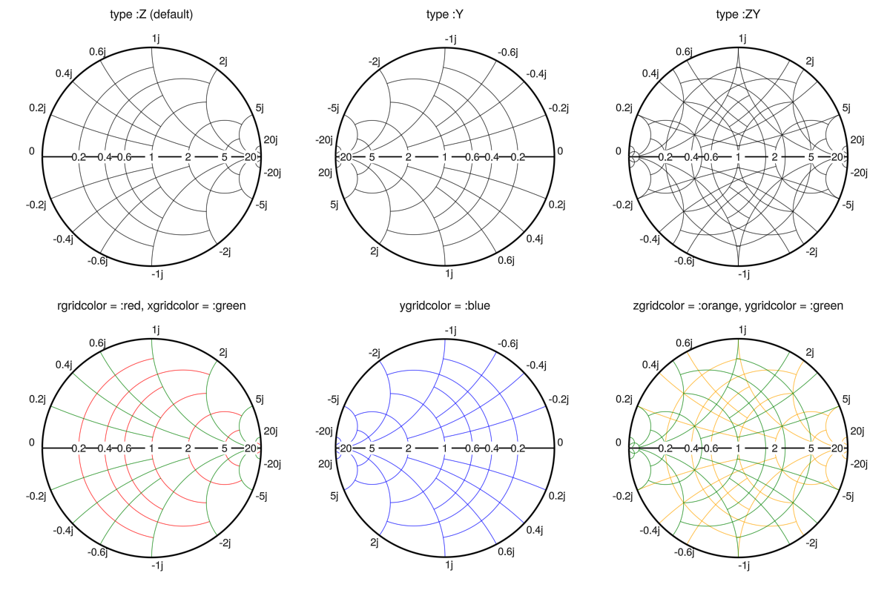

# SmithChart

A Julia library for creating interactive Smith charts using Makie.jl.
This project originated as an exploration of the interactive possibilities that Makie offers.

**Note**: Certain visual details of the Smith Chart may require further refinement to enhance aesthetic and overall visual quality.

**Note**: Some of the features are experimental. They might not function fully as expected or could be subject to changes in future versions. 

**Note**: It is possible that currently there are too many keywords. Options are being considered to simplify some aspects.

## Usage

```julia
using SmithChart
using GLMakie # Select Backend 
fig = Figure()
ax = SmithAxis(fig[1, 1]; cutgrid = true, subgrid = true, title = "Variable Length Lossy Transmission Line")
# Lossy transmission line
Zo = 50
Zl = 100 + 50im
f = 3.0e9
λ = 3.0e8/f
σ = 6.5
β = 2*pi/λ
s = σ + β*im
l = range(0,λ,101)
# Normalized Impedance
z = [(Zl+(Zo*tanh(s*li)))/(Zo+(Zl*tanh(s*li))) for li in l]
# Draw lines on the Smith Chart
smithplot!(ax, z, reflection = false, color = 1:101, freq = 3.0e9 * ones(length(z)))
# Scatter points on the origin and end points
smithscatter!(ax, [z[1]], markersize = 12.0)
smithscatter!(ax, [z[end]], markersize = 12.0, marker = :cross)
# Colorbar representing the length of the line
Colorbar(fig[1,2], limits = (l[1]/λ, l[end]/λ), ticks = ([0.0, 0.5, 1.0], ["0.0", "λ/2", "λ"]))
# Activate Data Inspector
DataInspector(fig)
fig
```


## Integration with Makie

This example showcases the seamless integration of the Smith chart with Makie.jl's interactive functionalities. It demonstrates a typical scenario used to teach impedance matching, where we aim to transform a source impedance of 50+100j $\Omega$ to a load impedance of 50 $\Omega$. To achieve this, we utilize a transmission line and a parallel stub, and control their lengths via sliders. By dynamically adjusting these lengths, users can observe how the source impedance seen by the load evolves on the Smith chart, visually illustrating the impedance matching process.

```julia

fig = Figure()
ax = SmithAxis(fig[1, 1], title = "Stub Matching")

Zl = 50.0
Ri = 50.0
Xi = 100.0
zi = Ri + Xi*im
zi = zi / Zl

function simline(z, l)
    bl = 2 * pi * l # Electrical length
    return (z + im * tan(bl)) / (1 + im * z * tan(bl))
end

function simstub(z, l)
    bl = 2 * pi * l
    y_stub = im * tan(-bl)
    return 1 / ((1 / z) + y_stub) 
end

N = 101
sg = SliderGrid(
    fig[2, 1],
    (label = "Line", range = range(0.0, 0.5, 151), format = "{:.3f}λ", startvalue = 0.0),
    (label = "Stub", range = range(0.0, 0.5, 151), format = "{:.3f}λ", startvalue = 0.0))

sliderobservables = [s.value for s in sg.sliders]
z = lift(sliderobservables...) do slvalues...
    line_index, stub_index = [slvalues...]
    line_p = range(0.0, line_index, N)
    stub_p = range(0.0, stub_index, N)
    z_line = simline.(zi, line_p)
    z_stub = simstub.(z_line[end], stub_p)
    return [zi; z_line; z_stub]
end

zend = lift(x->x[end], z)
smithscatter!(zi)
smithplot!(z)
smithscatter!(zend)
fig
```


## Plot Reflection Coefficientes

You can also draw reflection data with the `reflection = true` keyword. This is useful, for example, when you want to visualize the S-parameters of a simulation or measurement.

```julia
zi = 3.8 - 1.9im
function simline(z, l)
    bl = 2 * pi * l 
    return (z + im * tan(bl)) / (1 + im * z * tan(bl))
end
l = range(0.0, 0.22, 101) 
z = simline.(zi, l)
fig = Figure(size = (900,600))
ax = SmithAxis(fig[1,1])
smithplot!(ax, z, label = "Impedance")
# Convert impedance z to reflection
Γ = @. (z-1)/(z+1)
# Plot with `reflection = true`
smithscatter!(ax, Γ[1:5:end], reflection = true, markersize = 11, color = :orange, marker = :cross, label = "Reflection\nreflection = true")
fig[1,2] = Legend(fig, ax)
fig
```


## Interactive Data Markers

Interactive data markers can be added to your Smith chart using the `datamarkers(sc::SmithAxis, gp::GridPosition)` function. Double-click on lines or scatter plots to place a marker. To remove a marker, double-click on it. Future enhancements may include marker dragging and real-time information updates.


## Stability, Gain and Noise Circles

SmithChart.jl allows visualization of constant gain circles, constant noise circles, and stability regions, essential for amplifier design and stability analysis. These features can be useful for tasks such as designing low-noise amplifiers (LNAs), power amplifiers, and ensuring the stability of circuits over a range of frequencies and impedances.

This example shows how to use the `NFCircle` and `CGCircle`. This functions returns an array of `Point2f` that can be used with Makie functions like `lines!` or `poly!`. 

```julia
using CairoMakie
f = Figure(size = (1200, 660))
sc = SmithAxis(f[1,1], cutgrid = true, title = "Constant NF Circles")

NF_to_F(nf) = 10.0^(nf/10.0)
Γopt = 0.5 * cis(130 * pi / 180)
NFmin = 1.6 # dB
Fmin = NF_to_F(NFmin)
F2dB = NF_to_F(2.0)
F2_5dB = NF_to_F(2.5)
F3dB = NF_to_F(3.0)
nf2 = NFCircle(F2dB, Fmin, Γopt, 20.0, 50.0, 361)
nf2_5 = NFCircle(F2_5dB, Fmin, Γopt, 20.0, 50.0, 361)
nf3 = NFCircle(F3dB, Fmin, Γopt, 20.0, 50.0, 361)

smithscatter!(sc, [Γopt], reflection = true, color = :blue, linewidth = 1.9)
text!(sc, "Γopt", position = Point2f(real(Γopt), imag(Γopt)),  offset  = (3, 3), color = :blue, font = :bold)
text!(sc, "$NFmin dB", position = Point2f(real(Γopt), imag(Γopt)),  offset  = (0, -16), color = :blue, font = :bold)

lines!(sc, nf2, color = :green, linewidth = 1.9)
text!(sc, "2.0 dB", position = nf2[45],  offset  = (2, 0), color = :green, font = :bold)

lines!(sc, nf2_5, color = :purple, linewidth = 1.9)
text!(sc, "2.5 dB", position = nf2_5[120],  offset  = (-35, 2), color = :purple, font = :bold)

lines!(sc, nf3, color = :orange, linewidth = 1.9)
text!(sc, "3.0 dB", position = nf3[260],  offset  = (2, 2), color = :orange, font = :bold)

# https://www.allaboutcircuits.com/technical-articles/designing-a-unilateral-rf-amplifier-for-a-specified-gain/
sc = SmithAxis(f[1,2], cutgrid = true, title = "Constant Gs Circles")

S11 = 0.533 * cis(176.6 / 180 * π)
S22 = 0.604 * cis(-58.0 / 180 * π)
Go = abs2(S11)
Gs_max = 1 / (1 - abs2(S11))
gain(dB) = 10.0^(dB/10.0)

g1 = gain(0.0) / Gs_max
g2 = gain(0.5) / Gs_max
g3 = gain(1.0) / Gs_max
g4 = gain(1.4) / Gs_max

c1 = CGCircle(g1, S11, 361)
c2 = CGCircle(g2, S11, 361)
c3 = CGCircle(g3, S11, 361)
c4 = CGCircle(g4, S11, 361)

smithscatter!(sc, [conj(S11)], reflection = true, color = :blue, linewidth = 1.9)
text!(sc, "S11*", position = Point2f(real(S11), -imag(S11)),  
    offset  = (-5, 7), color = :blue, font = :bold, fontsize = 9)

poly!(sc, c1, color = (:green, 0.1), strokecolor = :green, strokewidth = 1.9)
text!(sc, "0.0 dB", position = c1[125],  offset  = (17, 0), color = :green, font = :bold)

lines!(sc, c2, color = :red, linewidth = 1.9)
text!(sc, "0.5 dB", position = c2[110],  offset  = (-27, 3), color = :red, font = :bold)

lines!(sc, c3, color = :magenta, linewidth = 1.9)
text!(sc, "1.0 dB", position = c3[260],  offset  = (2, 0), color = :magenta, font = :bold)

lines!(sc, c4, color = :purple, linewidth = 1.9)
text!(sc, "1.4 dB", position = c3[45],  offset  = (2, 2), color = :purple, font = :bold)
```


When calculating the stability regions, you can select whether you want to display the stable or unstable region. To do this, modify the keyword `stable` in the `StabilityCircle` function.

```julia
using CairoMakie
f = Figure(size = (800, 500))
Label(f[0, 1:2] , "Stable Regions", fontsize = 24, font = :bold)
S11, S12, S21, S22 =  [0.438868-0.778865im 1.4+0.2im; 0.1+0.43im  0.692125-0.361834im]
A =  StabilityCircle(S11, S12, S21, S22, :source, 361; stable = false)
B =  StabilityCircle(S11, S12, S21, S22, :source, 361; stable = true)

ax = SmithAxis(f[1,1], subtitle = "StabilityCircle(... ; stable = false)")
region = poly!(ax, A, strokecolor = :black, strokewidth = 1.2, color = Pattern('x', linecolor = :red, width = 1.3, background_color = (:red, 0.1)))
translate!(region, (0, 0, -2)) 
text!(ax, "Unstable Input Region", position = Point2f(-0.1, -0.5), font = :bold, color = :red, fontsize = 13)
B =  StabilityCircle(S11, S12, S21, S22, :source, 361; stable = true);
ax = SmithAxis(f[1,2], subtitle = "StabilityCircle(... ; stable = true)")
region = poly!(ax, B, strokecolor = :black, strokewidth = 1.2, color = Pattern('\\', linecolor = :blue, width = 1.3, background_color = (:blue, 0.1)))
translate!(region, (0, 0, -2)) 
text!(ax, "Stable Input region", position = Point2f(-0.5, -0.5), font = :bold, color = :blue, fontsize = 13)
```


It is possible to obtain the input or output stability regions with `StabilityCircle(S11, S12, S21, S22, :source, npoints)` or `StabilityCircle(S11, S12, S21, S22, :load, npoints)`.

```julia
f = Figure()
S11, S12, S21, S22 = [ 0.0967927-0.604297im  0.0255292+0.0394621im ; -8.4396+11.0786im    0.552226-0.425271im]
A =  StabilityCircle(S11, S12, S21, S22, :source, 361; stable = true);
B =  StabilityCircle(S11, S12, S21, S22, :load, 361; stable = true);
ax = SmithAxis(f[1,1], title = "Input and Output stability regions")
color1 = Pattern('/', linecolor = :blue, width = 1.3, background_color  = :transparent)
color2 = Pattern('\\', linecolor = :green, width = 1.3, background_color  = :transparent)
region = poly!(ax, A, strokecolor = :black, strokewidth = 1.2, color = color1)
translate!(region, (0, 0, -2)) 
region = poly!(ax, B, strokecolor = :black, strokewidth = 1.2, color = color2)
translate!(region, (0, 0, -2)) 
text!(ax, "Stable Input", position = Point2f(-0.85, 0.2), font = :bold, color = :blue, rotation = 25*pi/180, fontsize = 12)
text!(ax, "Stable Output", position = Point2f(0.3, 0.5), font = :bold, color = :green, rotation = -18*pi/180, fontsize = 12)
```


## Dynamic Annotation Update

You can activate a experimental dynamic curve annotation with the keyword `textupdate = true`

```julia
fig = Figure(size = (800,600))
ax = SmithAxis(fig[1, 1]; subgrid = true, cutgrid = true, zoomupdate = true, textupdate = true, threshold = (150, 150))
```


## Other Keywords

How some keywords modify visual aspects of the Smith Chart.

### Chart type and grid colors

It is possible to change the type of smith chart or modify the color of the grid or subgrid.



### Interior tick options

There are multiple keywords to modify the position of the ticks. Some of them are:


### Threshold keyword

`threshold` keyword controls the cut of the lines in the intersection with other arcs.


### Subgrid split

The `splitgrid` keyword controls the number of cuts for each zoomlevel. The value should be a 


