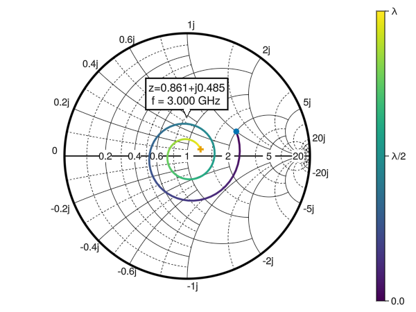

# SmithChart

A Julia library for creating interactive Smith charts using Makie.jl.
This project originated as an exploration of the interactive possibilities that Makie.jl offers.

**Note**: Some of the features are experimental. They might not function fully as expected or could be subject to changes in future versions. 

**Note**: Certain visual details of the Smith Chart may require further refinement to enhance aesthetic and overall visual quality.

## Usage

```julia
using SmithChart
using GLMakie # Select Backend 
fig = Figure()
ax = SmithAxis(fig[1, 1]; cutgrid = true, subgrid = true, title = "Variable Length Lossy Transmission Line")
# Lossy transmission line
Zo = 50
Zl = 100 + 50im
f = 3.0e9
λ = 3.0e8/f
σ = 6.5
β = 2*pi/λ
s = σ + β*im
l = range(0,λ,101)
# Normalized Impedance
z = [(Zl+(Zo*tanh(s*li)))/(Zo+(Zl*tanh(s*li))) for li in l]
# Draw lines on the Smith Chart
smithplot!(ax, z, reflection = false, color = 1:101, freq = 3.0e9 * ones(length(z)))
# Scatter points on the origin and end points
smithscatter!(ax, [z[1]], markersize = 12.0)
smithscatter!(ax, [z[end]], markersize = 12.0, marker = :cross)
# Colorbar representing the length of the line
Colorbar(fig[1,2], limits = (l[1]/λ, l[end]/λ), ticks = ([0.0, 0.5, 1.0], ["0.0λ", "0.5λ", "1.0λ"]))
# Activate Data Inspector
DataInspector(fig)
fig
```



You can also draw reflection coefficients (S-parameters) with the `reflection = true` keyword. 
```julia
zi = 3.8 - 1.9im
function simline(z, l)
    bl = 2 * pi * l 
    return (z + im * tan(bl)) / (1 + im * z * tan(bl))
end
l = range(0.0, 0.22, 101) 
z = simline.(zi, l)
fig = Figure(size = (900,600))
ax = SmithAxis(fig[1,1])
smithplot!(ax, z, label = "Impedance")
# Convert impedance z to reflection
Γ = @. (z-1)/(z+1)
# Plot with `reflection = true`
smithscatter!(ax, Γ[1:5:end], reflection = true, markersize = 11, color = :orange, marker = :cross, label = "Reflection\nreflection = true")
fig[1,2] = Legend(fig, ax)
fig
```


## Interactive Data Markers

Interactive data markers can be added to your Smith chart using the `datamarkers(sc::SmithAxis, gp::GridPosition)` function. Double-click on lines or scatter plots to place a marker. To remove a marker, double-click on it. Future enhancements may include marker dragging and real-time information updates.


## Dynamic Annotation Update

You can activate a experimental dynamic curve annotation with the keyword `textupdate = true`

```julia
fig = Figure(size = (800,600))
ax = SmithAxis(fig[1, 1]; subgrid = true, cutgrid = true, zoomupdate = true, textupdate = true, threshold = (150, 150))
```


## Other Keywords

In the folder Images there are examples of some keywords.


