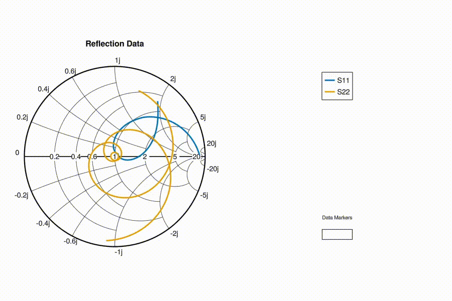

# Interactive Data Markers

Interactive markers can be added to a Smith chart using the function `datamarkers(sc::SmithAxis, gp::GridPosition)`. `sc` is your SmithAxis block and `gp` is a `GridPosition` where the interactive widget will be placed—this can be a position like fig[1, 2] or GridLayout.

**Add marker**: Double-click on a plotted line or scatter point.

**Remove marker**: Double-click on an existing marker.

**Move marker**: Drag it using the left mouse button.

