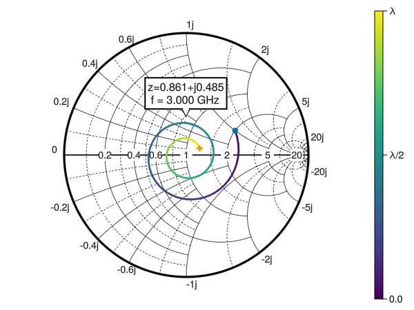

# SmithChart.jl

## Features

- **Interactive Smith Charts**: Built on Makie.jl, SmithChart.jl allows for visualization and exploration of impedance and reflection data.
- **SmithAxis Block**: Provides a dedicated SmithAxis block, similar to Axis or PolarAxis, for drawing the Smith chart grid.
- **smithplot! and smithscatter! Functions**: These functions are used to plot data on the Smith chart and have the same attributes as Makie’s lines! and scatter! respectively. They also include a convenient reflection keyword, allowing you to plot reflection data directly without manual conversion. Both functions feature a customised DataInspector (see examples below).
- **vswr! Function**: plot constant VSWR circles on the Smith chart using vswr!.
- **Normalized Data**: Currently, the package assumes that impedance or admittance values are already normalized.
- **Interactive Data Markers**: Add and remove data markers with a double-click directly on the plots using the datamarkers function.
- **Customizable Grid**: Offers extensive customization options for the Smith chart grid, including:
    Tick positions for constant resistance and reactance circles.
    Color and linestyle control for the grid lines.
    Line cutting at intersections to prevent visual clutter.
- **Dynamic Text Annotations**: An optional feature allows tick annotations to move dynamically while zooming to keep them visible. This functionality is still under development and may need further refinement.

